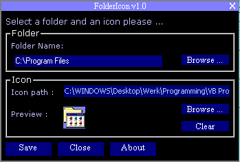



## FolderIcon

### Description

This prog. let's you decorate folders with an icon !

It works very easy. And it has the great interface you've seen on PassGen and Sub7 ...

FolderIcon comes with an small but very cool icon libery ...

Try this !!!
 
### More Info
 

             |
---                |---
**Submitted On**   |2000-05-16 23:38:08
**By**             |[Matthias Stevens](https://github.com/Planet-Source-Code/PSCIndex/blob/master/ByAuthor/matthias-stevens.md)
**Level**          |Intermediate
**User Rating**    |4.8 (19 globes from 4 users)
**Compatibility**  |VB 5\.0, VB 6\.0
**Category**       |[Complete Applications](https://github.com/Planet-Source-Code/PSCIndex/blob/master/ByCategory/complete-applications__1-27.md)
**World**          |[Visual Basic](https://github.com/Planet-Source-Code/PSCIndex/blob/master/ByWorld/visual-basic.md)
**Archive File**   |[CODE\_UPLOAD59115192000\.zip](https://github.com/Planet-Source-Code/matthias-stevens-foldericon__1-8198/archive/master.zip)

